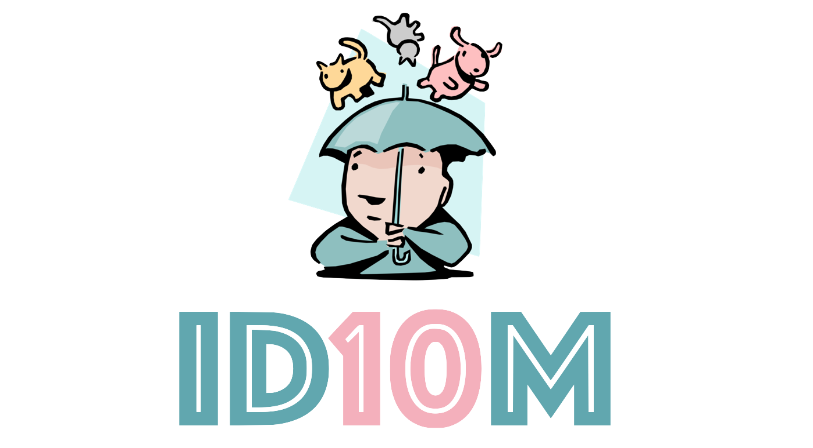

 
--------------------------------------------------------------------------------

Datasets and source code for the paper [ID10M: Idiom Identification in 10 Languages](https://www.researchgate.net/publication/360515160_ID10M_Idiom_Identification_in_10_Languages).

**Please consider citing our work if you use data and/or code from this repository.**

#### Bibtex
```bibtex
@inproceedings{tedeschi-etal-2022-id10m,
    title = "{ID}10{M}: Idiom Identification in 10 Languages",
    author = "Tedeschi, Simone  and
      Martelli, Federico  and
      Navigli, Roberto",
    booktitle = "Findings of the Association for Computational Linguistics: NAACL 2022",
    month = jul,
    year = "2022",
    address = "Seattle, United States",
    publisher = "Association for Computational Linguistics",
    url = "https://aclanthology.org/2022.findings-naacl.208",
    doi = "10.18653/v1/2022.findings-naacl.208",
    pages = "2715--2726",
    abstract = "Idioms are phrases which present a figurative meaning that cannot be (completely) derived by looking at the meaning of their individual components.Identifying and understanding idioms in context is a crucial goal and a key challenge in a wide range of Natural Language Understanding tasks. Although efforts have been undertaken in this direction, the automatic identification and understanding of idioms is still a largely under-investigated area, especially when operating in a multilingual scenario. In this paper, we address such limitations and put forward several new contributions: we propose a novel multilingual Transformer-based system for the identification of idioms; we produce a high-quality automatically-created training dataset in 10 languages, along with a novel manually-curated evaluation benchmark; finally, we carry out a thorough performance analysis and release our evaluation suite at https://github.com/Babelscape/ID10M.",
}
```

In a nutshell, ID10M is a novel framework consisting of systems, training and validation data, and benchmarks for the identification of idioms in 10 languages.

<br>

# Training and Development Data
Here you can find the automatically-created data that we used to train and evaluate our systems:

| Language | Train | Dev | Sentences | Tokens | Idioms | B | I | O | Literal |
| :------------- | :------------- | :------------- | -------------: | -------------: | -------------: | -------------: | -------------: | -------------: | -------------: |
| Chinese | [train_chinese.tsv](resources/bio_format/chinese/train_chinese.tsv) | [dev_chinese.tsv](resources/bio_format/chinese/dev_chinese.tsv) | 9543 | 244422 | 1301 | 5272 | 3823 | 235327 | 3918 |
| Dutch | [train_dutch.tsv](resources/bio_format/dutch/train_dutch.tsv) | [dev_dutch.tsv](resources/bio_format/dutch/dev_dutch.tsv) | 20935 | 548872 | 189 | 4530 | 10543 | 533799 | 16366 |
| English | [train_english.tsv](resources/bio_format/english/train_english.tsv) | [dev_english.tsv](resources/bio_format/english/dev_english.tsv) | 37919 | 1199492 | 4568 | 10102 | 19884 | 1169506 | 27408 |
| French | [train_french.tsv](resources/bio_format/french/train_french.tsv) | [dev_french.tsv](resources/bio_format/french/dev_french.tsv) | 35588 | 939161 | 188 | 12112 | 25248 | 901801 | 23238 |
| German | [train_german.tsv](resources/bio_format/german/train_german.tsv) | [dev_german.tsv](resources/bio_format/german/dev_german.tsv) | 26963 | 722109 | 819 | 8311 | 11500 | 702298 | 18488 |
| Italian | [train_italian.tsv](resources/bio_format/italian/train_italian.tsv) | [dev_italian.tsv](resources/bio_format/italian/dev_italian.tsv) | 29523 | 813445 | 452 | 8768 | 12353 | 792324 | 20506 |
| Japanese | [train_japanese.tsv](resources/bio_format/japanese/train_japanese.tsv) | [dev_japanese.tsv](resources/bio_format/japanese/dev_japanese.tsv) | 6388 | 211437 | 165 | 2534 | 1662 | 207241 | 3852 |
| Polish | [train_polish.tsv](resources/bio_format/polish/train_polish.tsv) | [dev_polish.tsv](resources/bio_format/polish/dev_polish.tsv) | 36333 | 862265 | 648 | 12971 | 14364 | 834930 | 22467 |
| Portuguese | [train_portuguese.tsv](resources/bio_format/portuguese/train_portuguese.tsv) | [dev_portuguese.tsv](resources/bio_format/portuguese/dev_portuguese.tsv) | 30942 | 764017 | 559 | 5824 | 8871 | 749322 | 24816 |
| Spanish | [train_spanish.tsv](resources/bio_format/spanish/train_spanish.tsv) | [dev_spanish.tsv](resources/bio_format/spanish/dev_spanish.tsv) | 28647 | 648776 | 1229 | 9994 | 13927 | 624855 | 17851 |

We underline that the just reported training data are automatically produced, hence they may contain errors. For further details about the produced silver data, please refer to the **Section 3.1** of the paper.

<br>

# Test Data
Here you can find the test sets used to evaluate our systems:

| Language | Test | Sentences | Tokens | Idioms | B | I | O | Seen | Unseen | Literal |
| :------------- | :------------- | :------------- | -------------: | -------------: | -------------: | -------------: | -------------: | -------------: | -------------: | -------------: |
| English | [test_english.tsv](resources/bio_format/english/test_english.tsv) | 200 | 3287 | 142 | 159 | 373 | 2755 | 62 | 80 | 41 |
| German | [test_german.tsv](resources/bio_format/german/test_german.tsv) | 200 | 4529 | 111 | 181 | 377 | 3971 | 71 | 40 | 19 |
| Italian | [test_italian.tsv](resources/bio_format/italian/test_italian.tsv) | 200 | 5043 | 139 | 155 | 271 | 4617 | 87 | 52 | 48 |
| Spanish | [test_spanish.tsv](resources/bio_format/spanish/test_spanish.tsv) | 200 | 2240 | 78 | 133 | 348 | 1759 | 19 | 59 | 66 |

For further details about the produced test data refer to the **Section 3.2** of the paper.

<br>

# Pretrained Models
The pretrained models are available here:

- [english.pt](https://drive.google.com/file/d/1I461VVNXVWoJDCDev3i1fsvwladre7Wy/view?usp=sharing)
- [german.pt](https://drive.google.com/file/d/1mOTL0Rz7CqMGzx-si0fIENAflK2NcLgh/view?usp=sharing)
- [italian.pt](https://drive.google.com/file/d/19l5JNXdvaV73AeCjqqr1d20Xll3H8Nak/view?usp=sharing)
- [spanish.pt](https://drive.google.com/file/d/1pEAhmzakTulD_U4TMeO2XOMJVxaqmhcQ/view?usp=sharing)

For further details about the neural architecture refer to the **Section 3.3** of the paper.

<br>

# How To Use
To run the code, you just need to perform the following steps:
1. Install the requirements:
    ```
    pip install -r requirements.txt
    ```
    The code requires **python >= 3.8**, hence we suggest you to create a conda environment with python 3.8.

2. To train or test the system, you just need to run the [main.py](/main.py) file
    ```
    python src/main.py
    ```

    Once the program is started it asks you to specify if you want to train or test the system, the desired language, etc.
    
    If you train the system, model checkpoints will be saved in the src/checkpoints folder. Otherwise, if you evaluate your system, the script will load the model checkpoints stored in the src/checkpoints folder.

<br>

# License 
ID10M is licensed under the CC BY-SA-NC 4.0 license. The text of the license can be found [here](https://github.com/Babelscape/idiombank/blob/master/LICENSE).

We underline that the source from which the raw sentences have been extracted is Wiktionary ([wiktionary.org](https://www.wiktionary.org/)) and the BIO annotations identifying idiomatic expressions have been produced by [Babelscape](https://babelscape.com/).


<br>

# Acknowledgments
We gratefully acknowledge the support of the **ERC Consolidator Grant MOUSSE No. 726487** under the European Union’s Horizon 2020 research and innovation programme ([http://mousse-project.org/](http://mousse-project.org/)) and the support of the **ELEXIS project No. 731015** under the European Union’s Horizon 2020 ([[http://mousse-project.org/](https://cordis.europa.eu/project/id/731015)]([http://mousse-project.org/](https://cordis.europa.eu/project/id/731015))).

